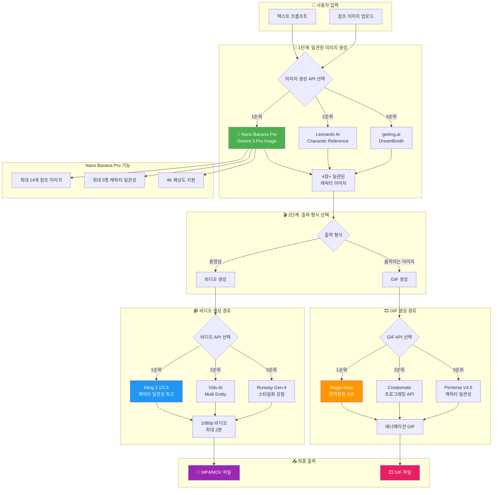
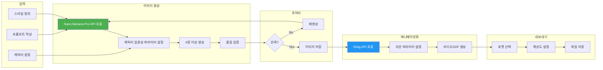
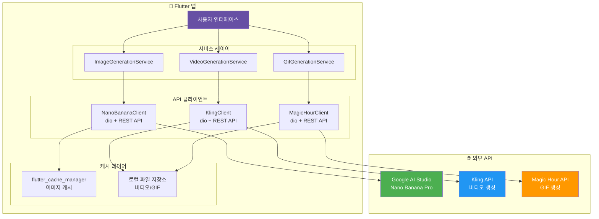
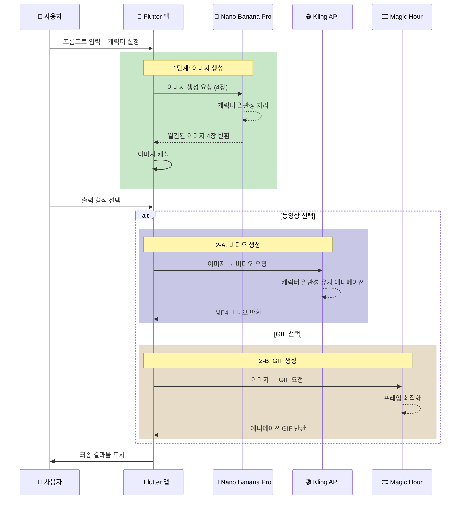
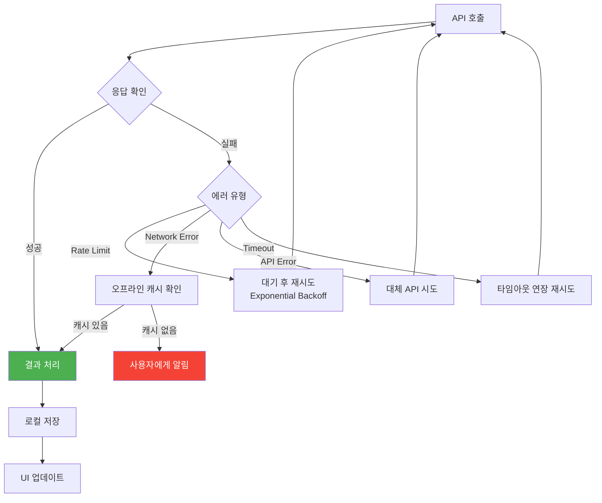
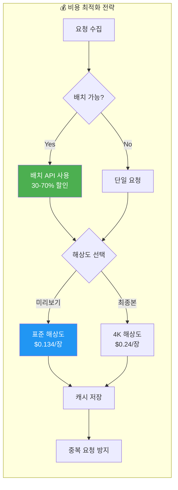

# AI 이미지/동영상 생성 플로우차트

## 전체 시스템 아키텍처



---

## 상세 워크플로우



---

## Flutter 앱 통합 아키텍처



---

## API 호출 시퀀스



---

## 에러 처리 플로우



---

## 비용 최적화 플로우



---

## 텍스트 버전 플로우차트

```
┌─────────────────────────────────────────────────────────────────────────┐
│                         🎨 AI 이미지/동영상 생성 플로우                    │
└─────────────────────────────────────────────────────────────────────────┘

                              ┌──────────────┐
                              │  👤 사용자    │
                              │   입력       │
                              └──────┬───────┘
                                     │
                    ┌────────────────┼────────────────┐
                    ▼                                 ▼
            ┌──────────────┐                 ┌──────────────┐
            │ 텍스트 프롬프트 │                 │ 참조 이미지   │
            └──────┬───────┘                 └──────┬───────┘
                    │                                 │
                    └────────────────┬────────────────┘
                                     ▼
┌─────────────────────────────────────────────────────────────────────────┐
│  🍌 1단계: Nano Banana Pro (Gemini 3 Pro Image)                         │
│  ├─ 최대 14개 참조 이미지 지원                                            │
│  ├─ 최대 5명 캐릭터 일관성 유지                                           │
│  └─ 4K 해상도 지원                                                      │
└─────────────────────────────────────────────────────────────────────────┘
                                     │
                                     ▼
                         ┌───────────────────┐
                         │  4장+ 일관된 이미지  │
                         └─────────┬─────────┘
                                   │
                    ┌──────────────┴──────────────┐
                    ▼                             ▼
    ┌───────────────────────────┐   ┌───────────────────────────┐
    │  📹 동영상 생성 경로         │   │  🎞️ GIF 생성 경로          │
    │                           │   │                           │
    │  ┌─────────────────────┐  │   │  ┌─────────────────────┐  │
    │  │ 🥇 Kling 2.1/2.5    │  │   │  │ 🥇 Magic Hour       │  │
    │  │ - 캐릭터 일관성 최고   │  │   │  │ - 최적화된 GIF      │  │
    │  │ - 1080p, 최대 2분   │  │   │  │ - MP4/GIF 내보내기   │  │
    │  └─────────────────────┘  │   │  └─────────────────────┘  │
    │                           │   │                           │
    │  ┌─────────────────────┐  │   │  ┌─────────────────────┐  │
    │  │ 🥈 Vidu AI          │  │   │  │ 🥈 Creatomate       │  │
    │  │ - Multi Entity      │  │   │  │ - 프로그래밍 API     │  │
    │  └─────────────────────┘  │   │  └─────────────────────┘  │
    │                           │   │                           │
    │  ┌─────────────────────┐  │   │  ┌─────────────────────┐  │
    │  │ 🥉 Runway Gen-4     │  │   │  │ 🥉 PixVerse V4.5    │  │
    │  │ - 스타일화 강점      │  │   │  │ - 캐릭터 일관성      │  │
    │  └─────────────────────┘  │   │  └─────────────────────┘  │
    └─────────────┬─────────────┘   └─────────────┬─────────────┘
                  │                               │
                  ▼                               ▼
         ┌──────────────┐                ┌──────────────┐
         │  🎥 MP4/MOV  │                │  🎞️ GIF 파일  │
         │    파일      │                │              │
         └──────────────┘                └──────────────┘


┌─────────────────────────────────────────────────────────────────────────┐
│                           💰 예상 비용 (4장 기준)                         │
├─────────────────────────────────────────────────────────────────────────┤
│  이미지 생성 (Nano Banana Pro 4K)  │  $0.24 × 4 = $0.96                 │
│  비디오 변환 (Kling 2.1)           │  ~$0.50 - $1.00                    │
│  ───────────────────────────────────────────────────────                │
│  총계                              │  ~$1.50 - $2.00                    │
└─────────────────────────────────────────────────────────────────────────┘
```

---

## API 엔드포인트 요약

| 단계 | API | 엔드포인트 |
|------|-----|-----------|
| 이미지 생성 | Nano Banana Pro | `https://generativelanguage.googleapis.com/v1beta/models/gemini-3-pro-image` |
| 비디오 생성 | Kling | `https://api.kling.ai/v1/videos/image2video` |
| GIF 생성 | Magic Hour | `https://api.magichour.ai/v1/gif/generate` |

