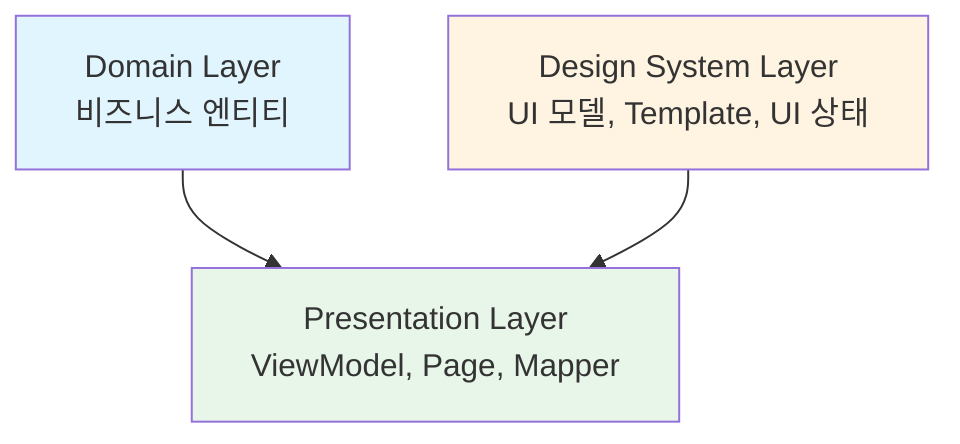
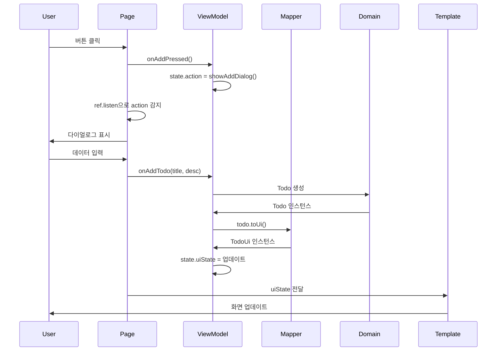

# Page 아키텍처

이 문서는 본 프로젝트의 Page 아키텍처 설계 사상과 구현 패턴을 설명합니다.

## 목차

- [개요](#개요)
- [아키텍처 구성](#아키텍처-구성)
- [각 레이어의 책임](#각-레이어의-책임)
- [PageState 패턴](#pagestate-패턴)
- [데이터 플로우](#데이터-플로우)
- [구현 예시: TodoListPage](#구현-예시-todolistpage)
- [명명 규칙과 모범 사례](#명명-규칙과-모범-사례)

---

## 개요

본 프로젝트는 **Clean Architecture**를 기반으로 한 **3계층 아키텍처**를 채택하고 있으며, 관심사의 명확한 분리를 통해 유지보수성, 테스트 가능성, 확장성을 실현하고 있습니다.

```
domain              design_system
(의존성 없음)        (의존성 없음)
   ↑                     ↑
   |                     |
   └──────────┬──────────┘
              ↑
         presentation
    (domain + design_system에 의존)
```

---

## 아키텍처 구성

### Page 관련 레이어 구성과 의존 관계



**의존 관계** (pubspec.yaml 기준):

1. **domain** (`packages/domain/`):
   - 의존성: 없음
   - 역할: 순수 비즈니스 엔티티 (예: `Todo`)

2. **design_system** (`packages/design_system/`):
   - 의존성: 없음
   - 역할: UI 모델, UI 상태, 액션, Template

3. **presentation** (`packages/presentation/`):
   - 의존성: `domain`, `design_system`
   ```yaml
   dependencies:
     domain:
       path: ../domain
     design_system:
       path: ../design_system
   ```
   - 역할: ViewModel, Page, Mapper (domain과 design_system 연결)

**핵심 원칙**:
- `domain`과 `design_system`은 **완전히 독립적**이며 서로를 알지 못함
- `presentation`이 domain과 design_system을 연결하는 브릿지 역할
- 단방향 의존성으로 각 레이어의 책임을 명확히 분리

---

## 각 레이어의 책임

### 1. Domain Layer (`packages/domain/`)

**역할**: 순수한 비즈니스 엔티티와 규칙

**특징**:
- Flutter나 다른 패키지에 대한 의존성 없음
- Freezed를 사용한 불변 객체
- UI와 무관한 비즈니스 로직

**예시**: `Todo` 엔티티

```dart
@freezed
class Todo with _$Todo {
  const factory Todo({
    required String id,
    required String title,
    required String description,
    required bool isCompleted,
    required DateTime createdAt,  // Domain: 원본 데이터
  }) = _Todo;
}
```

**참조**: `packages/domain/lib/todo.dart:1`

---

### 2. Design System Layer (`packages/design_system/`)

**역할**: 순수 UI 컴포넌트와 UI 모델

**특징**:
- **상태 관리 없음** (StatelessWidget만 사용)
- UI 모델: Domain 모델의 표시용 포맷 버전
- UI 상태 정의 (`*_ui_state.dart`)와 액션 (`*Action`)
- Template: 데이터와 콜백을 받기만 하는 순수 UI

#### 2.1 UI 모델 (`TodoUi`)

Domain 모델을 UI 표시용으로 변환한 모델입니다.

```dart
@freezed
class TodoUi with _$TodoUi {
  const factory TodoUi({
    required String id,
    required String title,
    required String description,
    required bool isCompleted,
    required String formattedDate, // UI용: 포맷팅된 문자열
  }) = _TodoUi;
}
```

**참조**: `packages/design_system/lib/todo/todo_ui.dart:1`

**핵심 포인트**:
- `createdAt: DateTime` → `formattedDate: String` (표시 준비 완료)
- UI 레이어에서 날짜 포맷팅 걱정 불필요

#### 2.2 UI 상태 (`*PageUiState`)

페이지에 표시할 **영속적인 데이터**를 보유합니다.

```dart
@freezed
class TodoListPageUiState with _$TodoListPageUiState {
  const factory TodoListPageUiState({
    @Default([]) List<TodoUi> todos,
    @Default(false) bool isLoading,
  }) = _TodoListPageUiState;
}
```

**참조**: `packages/design_system/lib/todo/todo_list_ui_state.dart:1`

#### 2.3 액션 (`*PageAction`)

**한 번만 실행되는 이벤트** (다이얼로그 표시, 화면 전환, 스낵바 등)입니다.

```dart
@freezed
class TodoListPageAction with _$TodoListPageAction {
  factory TodoListPageAction.none() = _None;
  factory TodoListPageAction.showAddDialog() = _ShowAddDialog;
  factory TodoListPageAction.showError(String message) = _ShowError;
}
```

**참조**: `packages/design_system/lib/todo/todo_list_ui_state.dart:16`

#### 2.4 Template (`*PageTemplate`)

순수한 UI 컴포넌트로, 상태 관리를 전혀 갖지 않습니다.

```dart
class TodoListPageTemplate extends StatelessWidget {
  const TodoListPageTemplate({
    required this.uiState,
    required this.onAddPressed,
    required this.onToggle,
    required this.onDelete,
  });

  final TodoListPageUiState uiState;
  final VoidCallback onAddPressed;
  final void Function(String id) onToggle;
  final void Function(String id) onDelete;

  @override
  Widget build(BuildContext context) {
    return Scaffold(
      appBar: AppBar(title: const Text('TODO 리스트')),
      body: uiState.isLoading
          ? const Center(child: CircularProgressIndicator())
          : ListView.builder(
              itemCount: uiState.todos.length,
              itemBuilder: (context, index) {
                final todo = uiState.todos[index];
                return TodoCard(
                  todo: todo,
                  onToggle: () => onToggle(todo.id),
                  onDelete: () => onDelete(todo.id),
                );
              },
            ),
      floatingActionButton: FloatingActionButton(
        onPressed: onAddPressed,
        child: const Icon(Icons.add),
      ),
    );
  }
}
```

**참조**: `packages/design_system/lib/todo/todo_list_template.dart:1`

**핵심 포인트**:
- `uiState`를 받아서 표시만 함
- 콜백을 호출만 함 (비즈니스 로직 없음)

---

### 3. Presentation Layer (`packages/presentation/`)

**역할**: 상태 관리, 데이터 변환, ViewModel, Page

**특징**:
- Riverpod을 사용한 상태 관리
- `@riverpod`을 통한 ViewModel 구현
- Domain → UI 모델로의 변환 (Mapper)
- `PageState<TUiState, TAction>` 래퍼

#### 3.1 PageState 래퍼

**영속적인 UI 상태**와 **일회성 액션**을 분리하는 범용 래퍼입니다.

```dart
@freezed
class PageState<TUiState, TAction> with _$PageState<TUiState, TAction> {
  const factory PageState({
    required TUiState uiState,
    required TAction action,
  }) = _PageState<TUiState, TAction>;
}
```

**참조**: `packages/presentation/lib/page_state.dart:1`

#### 3.2 Mapper (Domain → UI 변환)

Extension 메서드로 Domain 모델을 UI 모델로 변환합니다.

```dart
extension TodoMapper on Todo {
  TodoUi toUi() {
    return TodoUi(
      id: id,
      title: title,
      description: description,
      isCompleted: isCompleted,
      formattedDate: DateFormat('yyyy/MM/dd HH:mm').format(createdAt),
    );
  }
}
```

**참조**: `packages/presentation/lib/todo/todo_mapper.dart:1`

#### 3.3 ViewModel

상태 관리와 비즈니스 로직을 담당합니다.

```dart
@riverpod
class TodoListPageViewModel extends _$TodoListPageViewModel {
  final List<Todo> _todos = [];

  @override
  PageState<TodoListPageUiState, TodoListPageAction> build() {
    return PageState(
      uiState: TodoListPageUiState(),
      action: TodoListPageAction.none(),
    );
  }

  void onFinishedAction() {
    state = state.copyWith(action: TodoListPageAction.none());
  }

  void onAddPressed() {
    state = state.copyWith(action: TodoListPageAction.showAddDialog());
  }

  Future<void> onAddTodo(String title, String description) async {
    state = state.copyWith(uiState: state.uiState.copyWith(isLoading: true));

    try {
      final newTodo = Todo(
        id: const Uuid().v4(),
        title: title,
        description: description,
        isCompleted: false,
        createdAt: DateTime.now(),
      );
      _todos.add(newTodo);

      state = state.copyWith(
        uiState: state.uiState.copyWith(
          todos: _todos.map((todo) => todo.toUi()).toList(),
          isLoading: false,
        ),
      );
    } catch (_) {
      state = state.copyWith(
        uiState: state.uiState.copyWith(isLoading: false),
        action: TodoListPageAction.showError('TODO 추가에 실패했습니다'),
      );
    }
  }

  void onToggleTodo(String id) { /* ... */ }
  void onDeleteTodo(String id) { /* ... */ }
}
```

**참조**: `packages/presentation/lib/todo/todo_list_page_view_model.dart:1`

**핵심 포인트**:
- 모든 public 메서드는 `on*` 접두사 사용
- 영속 상태 변경 → `uiState` 업데이트
- 일회성 이벤트 → `action` 설정

#### 3.4 Page (ViewModel과 Template 연결)

ViewModel의 상태를 감시하고, Template에 데이터와 콜백을 전달합니다.

```dart
class TodoListPage extends ConsumerWidget {
  const TodoListPage({super.key});

  @override
  Widget build(BuildContext context, WidgetRef ref) {
    final state = ref.watch(todoListPageViewModelProvider);

    // 액션 감시 (일회성 이벤트 처리)
    ref.listen(
      todoListPageViewModelProvider.select((value) => value.action),
      (_, next) {
        if (!context.mounted) return;

        next.when(
          none: () {},
          showAddDialog: () => _showAddDialog(context, ref),
          showError: (message) => ScaffoldMessenger.of(context)
              .showSnackBar(SnackBar(content: Text(message))),
        );

        // 액션 처리 후, 반드시 리셋
        ref.read(todoListPageViewModelProvider.notifier).onFinishedAction();
      },
    );

    // Template에 데이터와 콜백 전달
    return TodoListPageTemplate(
      uiState: state.uiState,
      onAddPressed: () =>
          ref.read(todoListPageViewModelProvider.notifier).onAddPressed(),
      onToggle: (id) =>
          ref.read(todoListPageViewModelProvider.notifier).onToggleTodo(id),
      onDelete: (id) =>
          ref.read(todoListPageViewModelProvider.notifier).onDeleteTodo(id),
    );
  }

  void _showAddDialog(BuildContext context, WidgetRef ref) {
    // 다이얼로그 표시 처리
  }
}
```

**참조**: `packages/presentation/lib/todo/todo_list_page.dart:1`

**핵심 포인트**:
- `ref.watch`: UI 상태 감시 (재렌더링)
- `ref.listen`: 액션 감시 (부수 효과 처리)
- 액션 처리 후 `onFinishedAction()` 반드시 호출

---

## PageState 패턴

### 왜 uiState와 action을 분리하는가?

| 구분 | uiState | action |
|------|---------|--------|
| **특성** | 영속적 | 일시적 |
| **용도** | 표시 데이터 | 부수 효과 이벤트 |
| **예시** | `todos`, `isLoading` | `showDialog`, `navigate`, `showSnackBar` |
| **처리** | `ref.watch`로 감시 | `ref.listen`으로 감시 |
| **리셋** | 불필요 | 필수 (`onFinishedAction`) |

### 액션 리셋이 필요한 이유

```dart
// ❌ 나쁜 예: 리셋하지 않으면 동일한 액션이 재발화되지 않음
state = state.copyWith(action: TodoListPageAction.showError('에러'));
// 다시 같은 에러를 표시하고 싶을 때, ref.listen이 반응하지 않음

// ✅ 좋은 예: 액션 처리 후 리셋
ref.listen(..., (_, next) {
  next.when(showError: (msg) => showSnackBar(msg));
  ref.read(notifier).onFinishedAction(); // none()으로 리셋
});
```

---

## 데이터 플로우

### 전체 플로우 다이어그램



### 구체적인 예시: TODO 추가 플로우

1. **User**: FAB (FloatingActionButton) 탭
2. **Page**: `onAddPressed()`를 ViewModel에 통지
3. **ViewModel**: `action = showAddDialog()` 설정
4. **Page**: `ref.listen`으로 `showAddDialog` 감지 → 다이얼로그 표시
5. **Page**: 다이얼로그에서 입력 완료 → `onAddTodo(title, desc)` 호출
6. **ViewModel**: `Todo` 엔티티 생성
7. **ViewModel**: `todo.toUi()`로 `TodoUi` 변환
8. **ViewModel**: `uiState.todos`에 추가
9. **Page**: `ref.watch`로 상태 변화 감지
10. **Template**: 새로운 `uiState`를 받아 재렌더링

---

## 구현 예시: TodoListPage

### 파일 구성

```
packages/
├── domain/
│   └── lib/
│       └── todo.dart                        # Domain 엔티티
├── design_system/
│   └── lib/
│       └── todo/
│           ├── todo_ui.dart                 # UI 모델
│           ├── todo_list_ui_state.dart      # UI 상태 + 액션
│           └── todo_list_template.dart      # Template
└── presentation/
    └── lib/
        ├── page_state.dart                  # 범용 PageState
        └── todo/
            ├── todo_mapper.dart             # Mapper
            ├── todo_list_page_view_model.dart  # ViewModel
            └── todo_list_page.dart          # Page
```

### 각 파일의 역할

| 파일 | 레이어 | 역할 |
|------|--------|------|
| `todo.dart` | Domain | 비즈니스 엔티티 (DateTime createdAt) |
| `todo_ui.dart` | Design System | UI 모델 (String formattedDate) |
| `todo_list_ui_state.dart` | Design System | UI 상태 (todos, isLoading) + 액션 정의 |
| `todo_list_template.dart` | Design System | 순수 UI (StatelessWidget) |
| `page_state.dart` | Presentation | 범용 래퍼 (uiState + action) |
| `todo_mapper.dart` | Presentation | Domain → UI 변환 |
| `todo_list_page_view_model.dart` | Presentation | 상태 관리 + 비즈니스 로직 |
| `todo_list_page.dart` | Presentation | ViewModel과 Template 연결 |

---

## 명명 규칙과 모범 사례

### 명명 규칙

| 종류 | 명명 패턴 | 예시 |
|------|----------|------|
| UI 모델 | `*Ui` | `TodoUi` |
| UI 상태 | `*PageUiState` | `TodoListPageUiState` |
| 액션 | `*PageAction` | `TodoListPageAction` |
| Template | `*PageTemplate` | `TodoListPageTemplate` |
| ViewModel | `*PageViewModel` | `TodoListPageViewModel` |
| Page | `*Page` | `TodoListPage` |
| Mapper | `*Mapper` (extension) | `TodoMapper` |
| ViewModel 메서드 | `on*` | `onAddPressed()`, `onToggleTodo(id)` |
| Mapper 메서드 | `to*` | `toUi()` |

### 모범 사례

#### ✅ DO

- **ViewModel 메서드는 모두 `on*`으로 명명**
  ```dart
  void onButtonPressed() { }
  void onItemSelected(String id) { }
  ```

- **액션 처리 후 반드시 `onFinishedAction()` 호출**
  ```dart
  ref.listen(..., (_, action) {
    action.when(/* ... */);
    ref.read(notifier).onFinishedAction();
  });
  ```

- **Domain → UI 변환은 Mapper extension으로 구현**
  ```dart
  extension TodoMapper on Todo {
    TodoUi toUi() => TodoUi(/* ... */);
  }
  ```

- **Template은 StatelessWidget만 사용**
  ```dart
  class FooTemplate extends StatelessWidget {
    const FooTemplate({required this.uiState, required this.onAction});
    final FooUiState uiState;
    final VoidCallback onAction;
  }
  ```

#### ❌ DON'T

- **Template에 상태 관리를 포함하지 않기**
  ```dart
  // ❌ 안 좋음
  class FooTemplate extends StatefulWidget { }
  ```

- **UI 모델에 DateTime 같은 원본 데이터를 포함하지 않기**
  ```dart
  // ❌ 안 좋음
  class TodoUi {
    final DateTime createdAt; // UI에서 날짜 포맷팅 필요
  }

  // ✅ 좋음
  class TodoUi {
    final String formattedDate; // 이미 포맷팅됨
  }
  ```

- **Page에 복잡한 비즈니스 로직을 작성하지 않기**
  ```dart
  // ❌ 안 좋음
  class TodoListPage extends ConsumerWidget {
    void addTodo() {
      final newTodo = Todo(...); // 비즈니스 로직
      _todos.add(newTodo);
    }
  }

  // ✅ 좋음: ViewModel에 위임
  ref.read(viewModelProvider.notifier).onAddTodo(title, desc);
  ```

---

## 정리

본 아키텍처의 특징:

1. **관심사의 분리**: Domain / Design System / Presentation의 명확한 책임 분리
2. **PageState 패턴**: 영속 상태 (uiState)와 일시 이벤트 (action)의 분리
3. **단방향 데이터 플로우**: User → Page → ViewModel → Mapper → Domain → UI
4. **테스트 가능성**: 각 레이어가 독립적이어서 유닛 테스트 용이
5. **재사용성**: Template은 순수 UI 컴포넌트로 다른 페이지에서도 활용 가능

이 아키텍처로 다음을 실현:

- 코드 유지보수성 향상
- 상태 관리의 명확화
- UI와 비즈니스 로직의 완전한 분리
- 확장 가능한 설계

---

## 참고 링크

- [CLAUDE.md](../CLAUDE.md) - 프로젝트 전체 개요
- [Riverpod 공식 문서](https://riverpod.dev/)
- [Freezed 공식 문서](https://pub.dev/packages/freezed)
